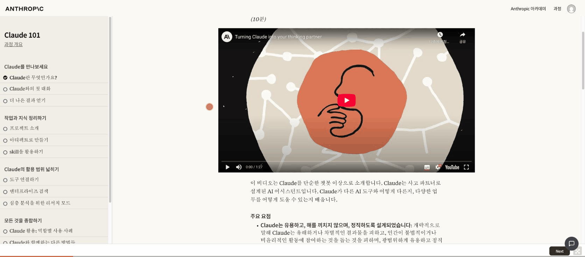
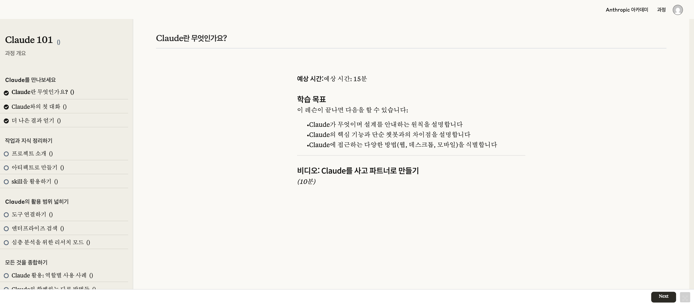
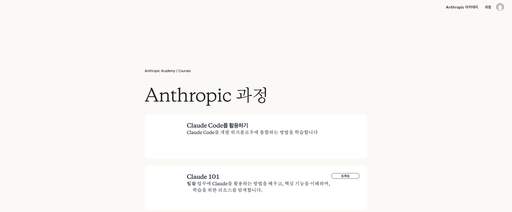

<div align="center">


# SkillBridge — AI Course Translator

> **Source manifest:** <!-- VERSION_START -->v3.5.42<!-- VERSION_END --> —
> unreleased CWS candidate. The existing `v3.5.41` tag predates this change
> set and is not reused.

> Available in multiple languages at the [project landing page](https://heznpc.github.io/skillBridge/).

[](https://github.com/heznpc/skillBridge/actions/workflows/ci.yml)
[](LICENSE)
[](https://developer.chrome.com/docs/extensions/)
[](https://extensionworkshop.com/)
[](https://microsoftedge.microsoft.com/addons/)
[](https://github.com/heznpc/skillbridge/stargazers)
[](https://github.com/heznpc/skillbridge/graphs/contributors)
[](CONTRIBUTING.md)

**Translate the free AI courses at [anthropic.skilljar.com](https://anthropic.skilljar.com/) into your language — instantly.**

Break the language barrier on these free AI courses. <!-- LANG_COUNT_START -->32 languages<!-- LANG_COUNT_END --> supported. The CWS edition combines course-page translation with local flashcards, bookmarks, progress, reading, and export tools. It runs on `anthropic.skilljar.com`, detected Skilljar-hosted AI courses, and Claude tutorial pages at `claude.com/resources/tutorials`; non-AI Skilljar tenants are paused automatically.

> **Version boundary:** the Chrome Web Store still serves legacy v1.0.1, which
> includes the Puter-backed Gemini/Claude path and YouTube host permission.
> Unless explicitly labeled legacy, references below to the “CWS edition” mean
> the next privacy-focused candidate. Publication of that candidate is paused;
> see the [version-split Privacy Policy](PRIVACY_POLICY.md).

[Install](#installation) · [Features](#features) · [Report Bug](https://github.com/heznpc/skillbridge/issues) · [Request Feature](https://github.com/heznpc/skillbridge/issues) · [Contributing](CONTRIBUTING.md)

</div>

---

<div align="center">



*Install SkillBridge, visit a course page at anthropic.skilljar.com, and the entire page is translated instantly.*

</div>

---

## Table of Contents

- [The Problem](#the-problem)
- [Quick Start](#quick-start)
- [Features](#features)
- [Installation](#installation)
- [How It Works](#how-it-works)
- [Architecture & Decisions](#architecture--engineering-decisions)
- [Supported Languages](#supported-languages)
- [Privacy & Security](#privacy--security)
- [Tech Stack](#tech-stack)
- [Contributing](#contributing)
- [FAQ](#faq)
- [License](#license)

## The Problem

The free AI courses at [anthropic.skilljar.com](https://anthropic.skilljar.com/) — covering prompt engineering, AI safety, the Claude API, and more — are one of the best free learning resources on the topic. Millions of developers worldwide want to take these courses, but they're **only available in English**.

Generic translators make it worse, not better:

| | Google Translate (page) | SkillBridge |
|---|---|---|
| AI terminology | ❌ "Prompt" → "신속한" (wrong) | ✅ "Prompt" → "프롬프트" (correct) |
| Technical accuracy | ❌ Generic machine translation | ✅ 1,100+ curated terms per Premium language |
| Learning tools | ❌ None | ✅ Local flashcards, bookmarks, progress, outline, PDF |
| Video subtitles | ❌ Separate manual toggle | ✅ Auto-translated subtitles |
| UI preservation | ❌ Breaks checkboxes, progress bars | ✅ All interactive elements preserved |
| Cost | Free | Free — no API keys needed |

**SkillBridge exists to remove this barrier** — making AI education accessible worldwide.

> **No API keys. No cost. Just install and learn.**

## Quick Start

1. Install the extension ([see below](#installation))
2. Visit a course page at [anthropic.skilljar.com](https://anthropic.skilljar.com/)
3. SkillBridge translates the entire page automatically

That's it.

## Features

### 🌐 Full Page Translation

Course headings, paragraphs, lists, navigation, cards, and supported code comments are translated, with AI-specific terms handled through curated dictionaries and protected-term restoration. Course controls and CJK font rendering remain intact. Text not already covered by the packaged dictionary or local cache is translated through Google Translate. Paragraphs that mix prose with links or buttons are only translated through the structure-preserving AI path — where that path isn't available they keep their original text, so link and button labels are never lost.

<div align="center">

<br/>
<em>Course lesson with full curriculum translated — UI elements preserved.</em>
</div>

### 🧰 Local Learning Tools

The CWS edition includes spaced-repetition flashcards, bookmarks, Continue/Recent links, a local progress dashboard, an in-lesson outline, reading progress, and PDF export. Learning-tool state stays in the browser.

> **Developer-source boundary:** the repository retains an optional Puter-based AI gateway for unpacked development and research. It is enabled in the raw source configuration. The CWS runtime pins that gateway off, exposes no AI Tutor, makes no AI-service requests, and omits the Puter SDK and page bridge. Dormant shared-source AI helpers or labels may remain as non-executing bundle strings.

### 🎬 Auto-Subtitles

Course videos automatically activate translated subtitles when you play them — no manual toggle needed.

### 🌙 Dark Mode

A full dark theme for the course header, lesson content, and SkillBridge panels. Toggle with one click.

### 🎓 Exam Mode & Certification Safety

**Course quizzes** (e.g., Claude 101 completion quiz) — answer choices on recognized quiz pages are skipped by translation to preserve accuracy (detection is URL- and page-selector-based).

**Proctored certification exams** (e.g., Claude Certified Architect) — on recognized certification routes the extension **disables itself**: no translation, no UI injection. Recognition is URL-pattern based, so treat it as a safeguard, not a guarantee — if Skilljar ships an exam under a URL the patterns don't cover yet, the extension won't know it's an exam. For any proctored exam, turn the extension off yourself.

### ⌨️ Keyboard Shortcuts

`Ctrl+Shift+S` toggle the sidebar, `Ctrl+Shift+F` open flashcards, `Ctrl+Shift+L` toggle dark mode, `Ctrl+Shift+/` open help, and `Escape` close.

### 📖 Per-Lesson Term Preview

When you enter a lesson, a floating card shows **6 key terms** for the current course with their translations. Auto-dismisses after 15 seconds. Click "View all" to open the full flashcard panel.

### 📄 PDF Export

Export any translated lesson as a clean, print-friendly PDF — useful for offline study or quick reference.

### 🔍 Smart Detection

Detects your browser language on first visit and offers to translate. Handles SPA navigation — when you move between lessons, the new page is translated automatically without a reload.

### 🛡️ Protected Terms

Generic translation tools often **mistranslate brand names and technical terms**. SkillBridge auto-corrects these errors after translation:

<div align="center">

| Before (Google Translate) | After (SkillBridge) |
|:---:|:---:|
| ❌ 인류학적 과정 | ✅ Anthropic 과정 |
| ❌ 클로드 | ✅ Claude |
| ❌ 신속한 공학 | ✅ 프롬프트 엔지니어링 |

</div>

<div align="center">

<br/>
<em>Course catalog translated to Korean — brand names and AI terms stay accurate.</em>
</div>

## Installation

> **Status: live as v1.0.1; v3.5.42 is the next CWS release candidate.**
> The Chrome Web Store listing is available in all locales **except the United
> States**, where it was removed on 2026-05-12 over a trademark issue with the
> old icon (since redesigned on `main`). The published store build is v1.0.1;
> The existing `v3.5.41` tag predates the current CWS changes and is not reused.
> `v3.5.42` contains the unreleased candidate. Publication of the rebuilt CWS
> edition remains paused while its package and external permission scope are
> verified.

### Chrome / Edge / Chromium browsers

**CWS-equivalent local bundle** (developer mode):

```bash
git clone https://github.com/heznpc/skillbridge.git
cd skillbridge
npm ci
npm run build:bundle
```

1. Open `chrome://extensions/` (Chrome) or `edge://extensions/` (Edge)
2. Enable **Developer mode** (top-right toggle)
3. Click **Load unpacked** → select `dist/bundled`
4. Visit [anthropic.skilljar.com](https://anthropic.skilljar.com/) and start learning!

Also works in Brave, Arc, Opera, Vivaldi, and other Chromium-based browsers.

> Loading the repository root instead selects the raw developer configuration.
> That source tree retains an optional Puter-based AI gateway that is not active
> in the candidate CWS runtime. Its packaged Puter SDK contains lazy remote
> JavaScript/WebAssembly paths. Review the source and privacy implications before
> using that developer-only path; never treat it as the CWS artifact.

### Firefox (Beta)

```bash
git clone https://github.com/heznpc/skillbridge.git
cd skillbridge
npm run build:firefox
```

1. Open `about:debugging#/runtime/this-firefox` in Firefox
2. Click **Load Temporary Add-on**
3. Navigate to `dist/firefox/` and select `manifest.json`
4. Visit [anthropic.skilljar.com](https://anthropic.skilljar.com/) and start learning!

> **Note:** Temporary add-ons are removed when Firefox restarts. For permanent installation, use a signed `.xpi` from [Firefox Add-ons](https://addons.mozilla.org/) (coming soon).

## How It Works

The CWS edition uses a staged translation engine that prioritizes local results:

```
Page text
  │
  ├─ 1,100+ curated term dictionary ──→ Instant (AI terms translated correctly)
  │
  ├─ Local cache (IndexedDB) ───────→ Instant (previous result)
  │
  └─ Remaining visible text → Google Translate
       │
       ├─ Protected Terms auto-fix ─→ Restores brand/tech terms GT mistranslates
       └─ Cache result locally for up to 30 days
```

Text not covered by the packaged dictionary or local cache is sent to Google Translate when translation is requested. The CWS runtime exposes no AI Tutor and makes no Puter, Gemini, or Claude-model request; its Puter SDK and page bridge are omitted. See the [Privacy Policy](PRIVACY_POLICY.md) for the CWS data flow and the separate raw-source developer boundary.

## Architecture & engineering decisions

The interesting part of SkillBridge is the constraints, not the feature count. A few decisions worth calling out:

**Why a multi-stage pipeline, not "just call an LLM."**
Translating a course page on every navigation has to be fast and predictable. The curated dictionary fixes terms generic MT gets wrong ("Prompt" → "프롬프트", never "신속한") at zero latency, the IndexedDB cache makes revisits instant, Google Translate covers the remaining visible text, and protected-term restoration runs after machine translation. Local results come first; the network is used only for text that still needs translation.

**Reliability & safety are designed in, not bolted on.**
- **Exam-safe by default** — on recognized proctored certification routes the extension *disables itself*, and on recognized quiz pages answer choices are skipped by translation. Detection is pattern-based (URLs + page selectors), so it is a safeguard rather than a guarantee: sitting a proctored exam, turn the extension off. A learning aid must not be mistakable for a cheating tool.
- **Invariants over hope** — brand/product terms ("Claude", "Cowork", "Agent Skills") are protected by a dictionary and restored *after* machine translation, rather than trusting the translator to leave them alone. (Generic concept words like "subagent" are translated natively per locale — see [docs/TRANSLATION_RULES.md](docs/TRANSLATION_RULES.md).)
- **Guarding against external drift** — the target site is a third party we don't control, so CI watchers detect when the platform adds a course or changes its DOM selectors and open an issue automatically, instead of letting users hit silent breakage.
- **Defensive content scripts** — idempotent injection guards and URL polling, because the host app navigates via SPA (content scripts can fire more than once — or not at all — per navigation).

**What I deliberately did *not* build (and why).**
- **No SkillBridge servers / no backend** — the CWS edition stores its learning state locally and sends translation text directly to Google Translate, at the deliberate cost of cross-device sync.
- **No telemetry or analytics** — nothing is collected, not even opt-in error reports; marketing convenience never outweighs the privacy promise.
- **No A/B framework, no paid tier** — both imply infrastructure (traffic, segmentation, billing) that a free, server-less project shouldn't fake.

The full "things we will not do" list is kept public on purpose in [TODO.md](TODO.md).

## Supported Languages

### Premium — Curated Dictionary + Google Translate

| Language | Code | Dictionary |
|----------|------|------------|
| 🇰🇷 한국어 (Korean) | `ko` | 1,100+ entries |
| 🇯🇵 日本語 (Japanese) | `ja` | 1,100+ entries |
| 🇨🇳 中文简体 (Chinese Simplified) | `zh-CN` | 1,100+ entries |
| 🇹🇼 中文繁體 (Chinese Traditional) | `zh-TW` | 1,100+ entries |
| 🇪🇸 Español (Spanish) | `es` | 1,100+ entries |
| 🇫🇷 Français (French) | `fr` | 1,100+ entries |
| 🇮🇹 Italiano (Italian) | `it` | 1,100+ entries (re-translated from English; native review welcome) |
| 🇩🇪 Deutsch (German) | `de` | 1,100+ entries |
| 🇧🇷 Português (Brazilian) | `pt-BR` | 1,100+ entries |
| 🇷🇺 Русский (Russian) | `ru` | 1,100+ entries |
| 🇻🇳 Tiếng Việt (Vietnamese) | `vi` | 1,100+ entries |
| 🇮🇩 Bahasa Indonesia | `id` | 1,100+ entries |

### Standard — Google Translate

🇵🇹 Português (PT) · 🇳🇱 Nederlands · 🇵🇱 Polski · 🇺🇦 Українська · 🇨🇿 Čeština · 🇸🇪 Svenska · 🇩🇰 Dansk · 🇫🇮 Suomi · 🇳🇴 Norsk · 🇹🇷 Türkçe · 🇸🇦 العربية · 🇮🇳 हिन्दी · 🇹🇭 ภาษาไทย · 🇲🇾 Bahasa Melayu · 🇵🇭 Filipino · 🇧🇩 বাংলা · 🇮🇱 עברית · 🇷🇴 Română · 🇭🇺 Magyar · 🇬🇷 Ελληνικά

> Want to add your language as Premium? Contribute a curated dictionary — see [CONTRIBUTING.md](CONTRIBUTING.md).

### Terminology QA — how accuracy is enforced, not just promised

New Academy content is covered by a standing pipeline, not by hand-checking:
a CI watcher polls the live catalog twice a day and **fails loudly + opens an
issue** the moment a course appears that the dictionaries don't cover; the
course gets wired into all 12 premium dictionaries; structural CI gates
(`check:i18n`, `check:dict-coverage`, `check:locales`) and a real-dictionary
regression suite guard every merge after that. Proven turnaround: on
**2026-06-10** the watcher flagged the brand-new *Claude Platform 101* course
in the morning ([#196](https://github.com/heznpc/skillBridge/issues/196)) and
all premium locales at the time were wired the same day
([#201](https://github.com/heznpc/skillBridge/pull/201)).

Beyond structure, dictionary *content* goes through layered review — CI gates
catch shape/contamination drift on every PR, a full per-locale LLM audit runs
before every store release (see `docs/TRANSLATION_QA.md`), and native-speaker
review is the final layer:

<!-- LOCALE_QA_START -->
| Language | Code | Entries | Last curated | Last LLM audit | Native review |
|---|---|---:|---|---|---|
| 한국어 | `ko` | 1129 | 2026-04-02 | 2026-06-10 | 🙋 [recruiting](https://github.com/heznpc/skillBridge/issues/202) |
| 日本語 | `ja` | 1129 | 2026-04-02 | 2026-06-10 | 🙋 [recruiting](https://github.com/heznpc/skillBridge/issues/202) |
| 中文(简体) | `zh-CN` | 1129 | 2026-04-02 | 2026-06-10 | 🙋 [recruiting](https://github.com/heznpc/skillBridge/issues/202) |
| 中文(繁體) | `zh-TW` | 1129 | 2026-04-02 | 2026-06-10 | 🙋 [recruiting](https://github.com/heznpc/skillBridge/issues/202) |
| Español | `es` | 1129 | 2026-04-02 | 2026-06-10 | 🙋 [recruiting](https://github.com/heznpc/skillBridge/issues/202) |
| Français | `fr` | 1129 | 2026-04-02 | 2026-06-10 | 🙋 [recruiting](https://github.com/heznpc/skillBridge/issues/202) |
| Italiano | `it` | 1129 | 2026-06-03 | 2026-06-10 | 🙋 [recruiting](https://github.com/heznpc/skillBridge/issues/202) |
| Deutsch | `de` | 1129 | 2026-04-02 | 2026-06-10 | 🙋 [recruiting](https://github.com/heznpc/skillBridge/issues/202) |
| Português (BR) | `pt-BR` | 1129 | 2026-04-02 | 2026-06-10 | 🙋 [recruiting](https://github.com/heznpc/skillBridge/issues/202) |
| Русский | `ru` | 1129 | 2026-04-02 | 2026-06-10 | 🙋 [recruiting](https://github.com/heznpc/skillBridge/issues/202) |
| Tiếng Việt | `vi` | 1129 | 2026-04-02 | 2026-06-10 | 🙋 [recruiting](https://github.com/heznpc/skillBridge/issues/202) |
| Bahasa Indonesia | `id` | 1129 | 2026-06-17 | 2026-06-17 | 🙋 [recruiting](https://github.com/heznpc/skillBridge/issues/202) |
<!-- LOCALE_QA_END -->

🙋 **Native speakers wanted** — a first native pass on your locale takes
~1–2 hours, needs no coding, and gets you credited here. See
[#202](https://github.com/heznpc/skillBridge/issues/202).

## Privacy & Security — Next CWS Candidate

These claims describe the unpublished candidate, not live legacy v1.0.1:

- **No operator analytics** — zero analytics, tracking, or telemetry; requested
  page text is still processed by Google Translate as disclosed
- **No SkillBridge servers** — we do not operate any servers; uncached page text is sent directly to Google Translate when translation is requested
- **No account required** — the CWS edition needs no account, email, password, user API key, or human-check
- **Local learning state** — original/translated text is cached in IndexedDB;
  preferences, flashcard review state, bookmarks, recent lessons, and scroll
  positions use `chrome.storage.local`; progress summaries are calculated locally
- **No active CWS AI gateway** — the CWS runtime exposes no AI Tutor or AI-service request and omits the Puter SDK and page bridge; dormant shared-source helpers may remain in the bundle
- **Open source** — every line of code is auditable right here

See our full [Privacy Policy](PRIVACY_POLICY.md).

## Tech Stack

| Component | Technology |
|-----------|-----------|
| Page Translation | Google Translate API |
| Protected Terms | Auto-correction of GT brand/product term errors per language (Claude, Cowork, Computer Use, Agent Skills, etc.) |
| Curated Dictionaries | Hand-tuned JSON (1,100+ × 12 languages) |
| Translation Cache | IndexedDB |
| Local Learning Tools | `chrome.storage.local` + IndexedDB |
| CWS Package Gate | AI gateway disabled; Puter/page bridge omitted; RHC scan required |
| CJK Font Rendering | Local system/Noto fallback stacks |

> **Built with [Claude Code](https://docs.anthropic.com/en/docs/claude-code).**
> This project — from architecture design and feature implementation to debugging and the demo GIF — was developed using Claude Code as an AI pair-programming partner.

## Contributing

SkillBridge is a community-driven project. The single most impactful way to contribute is improving the translation dictionary for your language — no code required, just edit a JSON file. Even fixing one bad translation helps every learner using that language.

Each language's dictionary is curated to sound natural to native speakers. We align with [Anthropic's official multilingual docs](https://docs.anthropic.com) as a baseline, but community conventions matter too — if Korean developers say "프롬프트" instead of "prompt", that's what we use. Disagree with a term choice? That's exactly the kind of PR we want.

See [CONTRIBUTING.md](CONTRIBUTING.md) for the full guide and [Good First Issues](https://github.com/heznpc/skillbridge/issues?q=is%3Aissue+is%3Aopen+label%3A%22good+first+issue%22) to get started.

## FAQ

<details>
<summary><strong>Does it work on browsers other than Chrome?</strong></summary>

Yes! SkillBridge supports **Chrome**, **Firefox**, and **Edge** (plus Brave, Arc, Opera, and Vivaldi). For Chrome/Edge, load the extension directly. For Firefox, run `npm run build:firefox` to generate a compatible build. See [Installation](#installation) for detailed instructions.
</details>

<details>
<summary><strong>Do I need an API key or account?</strong></summary>

No. The unpublished CWS candidate translates through packaged dictionaries, local cache, and Google Translate without an account, email, password, user API key, or human-check. The repository's optional Puter-based developer path is not included in that package. See the version notice above for the currently published legacy v1.0.1 boundary.
</details>

<details>
<summary><strong>Why does my language show as "Standard" instead of "Premium"?</strong></summary>

Premium languages have a hand-curated dictionary (1,100+ entries) that catches AI/ML term mistranslations. Standard languages use Google Translate plus local protected-term restoration. Want to promote your language? Contribute a dictionary — see <a href="CONTRIBUTING.md">CONTRIBUTING.md</a>.
</details>

<details>
<summary><strong>The translation looks wrong. How do I report it?</strong></summary>

Open an <a href="https://github.com/heznpc/skillbridge/issues">issue</a> with the original English text, the bad translation, and your suggested correction. Or even better — submit a PR directly to the dictionary JSON file for your language.
</details>

<details>
<summary><strong>Is this project affiliated with Anthropic?</strong></summary>

No. SkillBridge is an unofficial community project. It is not affiliated with, endorsed by, or sponsored by Anthropic. "Anthropic", "Claude", and "Skilljar" are trademarks of their respective owners.
</details>

## Roadmap

- ~~Firefox and Edge Add-on support~~ (shipped in v2.0.0)
- ~~Exam mode — answer choice protection~~ (shipped in v2.0.0)
- ~~Certification exam kill-switch~~ (shipped in v2.1.0)
- ~~SPA navigation handling~~ (shipped in v2.1.0)
- ~~New course support: Cowork, subagents, MCP Advanced Topics~~ (shipped in v2.1.0)
- ~~Per-lesson term preview, PDF export, offline cache hardening~~ (shipped in v3.5.0)
- ~~Firefox AMO deployment pipeline~~ (shipped in v3.5.0)
- Additional curated language dictionaries (community-driven)
- Translation quality analytics and community review
- Multi-LMS platform support beyond Skilljar


## Disclaimer

SkillBridge is a personal translation tool, similar to your browser's built-in translate feature. Text is translated on-the-fly in your browser — never stored or redistributed.

> **SkillBridge** is an unofficial, independent community project. It is not affiliated with, endorsed by, or sponsored by Anthropic or Skilljar. References to "Anthropic", "Claude", "Skilljar", and `anthropic.skilljar.com` are nominative — they describe the third-party platform and content this extension translates. All trademarks remain the property of their respective owners.

## License

[MIT](LICENSE)

---

If you find SkillBridge useful, consider [starring the repo](https://github.com/heznpc/skillbridge/stargazers). It helps more learners discover the project.
